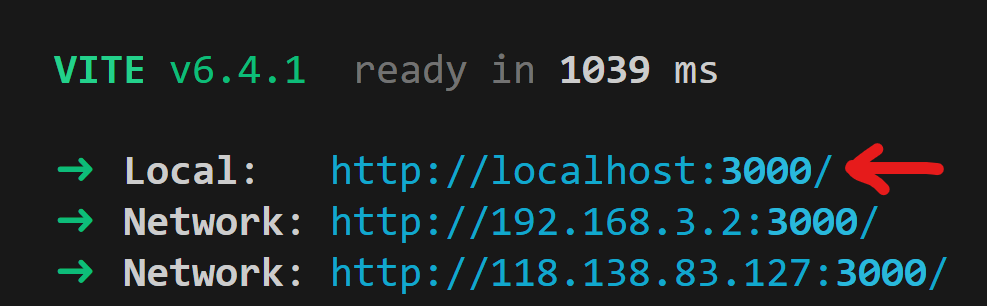

# UNIHACK-2026-TOILETGO

The best toilet app in Australia.

#INSTALL INSTRUCTIONS
Pre-requisite
Node.js Version 24.14.0+
1. in ToiletGo folder run npm install
2. change value in .env file to Gemini API Key
3. run in ToiletGo folder npm run dev
4. In terminal click local website link next to Local:
   
   
